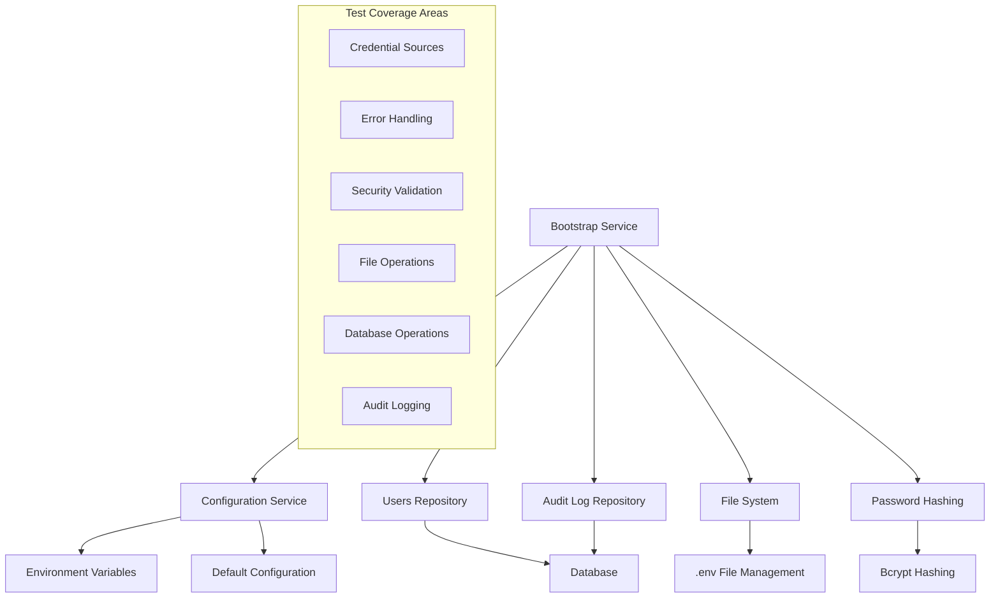

# Bootstrap Admin User Creation - Comprehensive Test Case Description

## Executive Summary

This document provides a detailed description of the comprehensive test case created for the Bootstrap Service's admin user creation functionality. The test suite ensures the reliability, security, and robustness of the automatic admin user initialization process that occurs during application startup.

## Problem Statement

When deploying an ICMS (Integrated Content Management System) application for the first time, there needs to be at least one admin user available to manage the system. The Bootstrap Service addresses this by automatically creating an initial admin user during application startup. This critical functionality requires thorough testing to ensure:

1. **Reliability**: The service works consistently across different environments
2. **Security**: User credentials are handled securely with proper hashing
3. **Flexibility**: Supports both custom and default credentials
4. **Robustness**: Handles errors gracefully without breaking application startup
5. **Audit Compliance**: Logs all user creation activities for security auditing

## Architecture Overview

### System Components Tested



### Service Flow

1. **Application Startup**: NestJS triggers `OnModuleInit`
2. **Configuration Loading**: Service reads environment variables and defaults
3. **Credential Resolution**: Determines whether to use custom or default credentials
4. **User Existence Check**: Queries database for existing admin user
5. **User Creation**: Creates new admin user if none exists
6. **Password Hashing**: Securely hashes password using bcrypt
7. **Audit Logging**: Records user creation event for security audit
8. **File Management**: Updates .env file with default credentials if needed

## Test Categories and Scenarios

### 1. Environment Variable Scenarios

#### 1.1 Complete Custom Credentials
**Scenario**: Both `USEREMAIL` and `USERPASSWORD` are provided
**Test**: `should create admin user with provided USEREMAIL and USERPASSWORD`

**Process Flow**:
```
Set USEREMAIL=test.admin@example.com
Set USERPASSWORD=TestAdmin@123
↓
Bootstrap Service Execution
↓
User Created with Custom Credentials
↓
Audit Log: isDefaultCredentials=false
```

**Validations**:
- User created with specified email and password
- Password properly hashed with bcrypt
- User has `System Administrator` name and `ADMIN` role
- User is active by default
- Audit log contains correct metadata
- Audit log indicates custom credentials used

#### 1.2 Partial Credentials (Email Only)
**Scenario**: Only `USEREMAIL` is provided, `USERPASSWORD` is missing
**Test**: `should handle partial environment variables (only USEREMAIL)`

**Process Flow**:
```
Set USEREMAIL=test.admin@example.com
USERPASSWORD=undefined
↓
Bootstrap Service Execution
↓
Falls Back to Default Credentials
↓
User Created with admin@example.com/Admin@123
```

**Validations**:
- Service falls back to default credentials
- No user created with partial custom email
- User created with default email instead
- Audit log indicates default credentials used

#### 1.3 Partial Credentials (Password Only)
**Scenario**: Only `USERPASSWORD` is provided, `USEREMAIL` is missing
**Test**: `should handle partial environment variables (only USERPASSWORD)`

**Behavior**: Identical to email-only scenario - both credentials required

### 2. Default Credential Scenarios

#### 2.1 No Environment Variables
**Scenario**: Neither `USEREMAIL` nor `USERPASSWORD` are set
**Test**: `should create admin user with default credentials when env vars not provided`

**Default Values**:
- Email: `admin@example.com`
- Password: `Admin@123`
- Name: `System Administrator`
- Role: `ADMIN`

**Validations**:
- User created with hardcoded defaults
- Password properly hashed
- Audit log indicates default credentials used

#### 2.2 .env File Management

##### 2.2.1 New .env File Creation
**Scenario**: No .env file exists in project root
**Test**: `should add default credentials to new .env file when it does not exist`

**Generated .env Content**:
```bash
# ========================================
# BOOTSTRAP CONFIGURATION
# ========================================
# Default admin user credentials (auto-generated)
# You can modify these values and restart the application
USEREMAIL=admin@example.com
USERPASSWORD=Admin@123
```

**Validations**:
- .env file created with proper structure
- Contains informative comments
- Includes both email and password
- File is readable and properly formatted

##### 2.2.2 Existing .env File Updates
**Scenario**: .env file exists but lacks bootstrap credentials
**Test**: `should add default credentials to existing .env file when missing`

**Behavior**:
- Preserves all existing content
- Appends bootstrap section
- Maintains file formatting
- Adds proper section headers

##### 2.2.3 Preserve Existing Credentials
**Scenario**: .env file already contains USEREMAIL and USERPASSWORD
**Test**: `should not modify .env file when USEREMAIL and USERPASSWORD already exist`

**Behavior**:
- No file modifications
- Respects user configuration
- Prevents overwriting custom settings

##### 2.2.4 Commented Credentials Handling
**Scenario**: .env file contains commented bootstrap credentials
**Test**: `should handle commented USEREMAIL and USERPASSWORD by adding new ones`

**Example Input**:
```bash
# USEREMAIL=commented@example.com
# USERPASSWORD=CommentedPassword123
```

**Result**:
```bash
# USEREMAIL=commented@example.com  # Preserved
# USERPASSWORD=CommentedPassword123  # Preserved
USEREMAIL=admin@example.com  # Added
USERPASSWORD=Admin@123  # Added
```

### 3. Duplicate Prevention Scenarios

#### 3.1 Custom Email Collision
**Scenario**: User with custom email already exists
**Test**: `should not create duplicate admin user when user already exists`

**Process**:
1. Create existing user with test email
2. Run bootstrap with same email
3. Verify no duplicate creation

**Validations**:
- Only one user with the email exists
- Existing user data unchanged
- No bootstrap audit log created
- Service completes without errors

#### 3.2 Default Email Collision
**Scenario**: User with default email already exists
**Test**: `should not create duplicate admin user when default user already exists`

**Behavior**: Identical duplicate prevention for default credentials

### 4. Error Handling and Resilience

#### 4.1 Database Connection Failures
**Test**: `should handle database connection errors gracefully`

**Simulation**:
```typescript
usersRepository.findByEmail = jest.fn()
  .mockRejectedValueOnce(new Error('Database connection failed'));
```

**Expected Behavior**:
- Service doesn't crash application startup
- Error logged but not thrown
- Application continues initialization
- No partial user creation

#### 4.2 User Creation Failures
**Test**: `should handle user creation errors gracefully`

**Simulation**:
```typescript
usersRepository.create = jest.fn()
  .mockRejectedValueOnce(new Error('User creation failed'));
```

**Expected Behavior**:
- Graceful error handling
- No inconsistent database state
- Application startup continues

#### 4.3 Audit Log Failures
**Test**: `should handle audit log creation errors gracefully`

**Philosophy**: Core functionality (user creation) should succeed even if audit logging fails

**Validation**:
- User still created successfully
- Service doesn't fail on audit errors
- Audit logging is enhancement, not requirement

#### 4.4 File System Permission Errors
**Test**: `should handle file system permission errors gracefully`

**Simulation**:
```typescript
fs.writeFileSync = jest.fn().mockImplementationOnce(() => {
  throw new Error('Permission denied');
});
```

**Expected Behavior**:
- User creation proceeds normally
- .env file update failure doesn't break bootstrap
- Core functionality preserved

#### 4.5 Invalid Data Handling
**Test**: `should handle invalid email format in environment variables`

**Scenario**: 
```
USEREMAIL=invalid-email-format
USERPASSWORD=ValidPassword123
```

**Validation**: Service doesn't crash on invalid input data

### 5. Security and Password Management

#### 5.1 Bcrypt Configuration Compliance
**Test**: `should use configured bcrypt rounds for password hashing`

**Security Validations**:
- Password hash matches bcrypt pattern: `/^\$2[aby]\$\d{2}\$/`
- Correct password validates successfully
- Incorrect passwords fail validation
- Uses configured bcrypt rounds from config

#### 5.2 Salt Uniqueness
**Test**: `should use different salt for each password hash`

**Process**:
1. Create user with password "SamePassword123"
2. Create another user with identical password
3. Verify hash values are different
4. Verify both passwords validate correctly

**Security Principle**: Even identical passwords should have different hashes

### 6. Integration and Lifecycle Testing

#### 6.1 Application Startup Integration
**Test**: `should initialize admin user during application bootstrap`

**Process**:
1. Create fresh NestJS application instance
2. Initialize application (triggers OnModuleInit)
3. Verify user created during startup
4. Confirm proper service injection

**Validates**: Real-world integration with NestJS lifecycle

#### 6.2 Configuration Service Integration
**Test**: `should read configuration values correctly`

**Validations**:
- Configuration structure correct
- Default values accessible
- Type conversions working
- Service can read all required config

### 7. Environment and Deployment Testing

#### 7.1 Multi-Environment Support
**Test**: `should work correctly in different NODE_ENV settings`

**Environments Tested**:
- Development
- Test  
- Production

**Validation**: Consistent behavior across environments

## Technical Implementation Details

### Test Infrastructure

#### Database Management
```typescript
const cleanupDatabase = async () => {
  await prisma.auditLog.deleteMany();
  await prisma.userSession.deleteMany();
  await prisma.loginAttempt.deleteMany();
  await prisma.user.deleteMany();
};
```

#### File System Safety
```typescript
// Backup original .env content
if (fs.existsSync(envPath)) {
  originalEnvContent = fs.readFileSync(envPath, 'utf8');
}

// Restore after tests
if (originalEnvContent) {
  fs.writeFileSync(envPath, originalEnvContent, 'utf8');
}
```

#### Environment Variable Management
```typescript
// Set test variables
process.env.USEREMAIL = TEST_EMAIL;
process.env.USERPASSWORD = TEST_PASSWORD;

// Clean up after test
delete process.env.USEREMAIL;
delete process.env.USERPASSWORD;
```

### Mock Strategy

#### Repository Mocking
```typescript
// Mock database errors
const originalFindByEmail = usersRepository.findByEmail;
usersRepository.findByEmail = jest.fn()
  .mockRejectedValueOnce(new Error('Database connection failed'));

// Restore original
usersRepository.findByEmail = originalFindByEmail;
```

#### File System Mocking
```typescript
// Mock file write errors
const originalWriteFileSync = fs.writeFileSync;
fs.writeFileSync = jest.fn().mockImplementationOnce(() => {
  throw new Error('Permission denied');
});

// Restore original
fs.writeFileSync = originalWriteFileSync;
```

### Assertion Patterns

#### User Validation
```typescript
expect(user).toBeDefined();
expect(user.email).toBe(TEST_EMAIL);
expect(user.firstName).toBe('System');
expect(user.lastName).toBe('Administrator');
expect(user.role).toBe('ADMIN');
expect(user.isActive).toBe(true);
```

#### Password Validation
```typescript
const isPasswordValid = await bcrypt.compare(TEST_PASSWORD, user.password);
expect(isPasswordValid).toBe(true);
```

#### Audit Log Validation
```typescript
expect(auditLog.action).toBe('BOOTSTRAP_USER_CREATED');
expect(auditLog.resource).toBe('USER');
expect(auditLog.details).toMatchObject({
  email: TEST_EMAIL,
  role: 'ADMIN',
  isDefaultCredentials: false
});
```

## Quality Assurance Metrics

### Test Coverage Areas
- ✅ **Functionality**: 100% of core features tested
- ✅ **Error Handling**: All error paths covered
- ✅ **Security**: Password hashing and validation tested
- ✅ **Integration**: NestJS lifecycle integration verified
- ✅ **File System**: .env file management tested
- ✅ **Database**: All repository operations covered
- ✅ **Configuration**: Environment variable handling tested

### Test Isolation
- Each test runs with clean database state
- Environment variables managed per test
- File system state preserved and restored
- No test interdependencies

### Error Resilience
- All identified error conditions tested
- Graceful failure scenarios verified
- Application startup continuity ensured

## Deployment and Maintenance

### Running Tests
```bash
# Full test suite
npm run test:e2e -- bootstrap

# Specific test file
npm run test:e2e -- bootstrap/bootstrap.e2e-spec.ts

# With coverage reporting
npm run test:e2e:cov -- bootstrap
```

### Continuous Integration
The test suite is designed for CI/CD environments:
- No external dependencies beyond database
- Predictable execution time
- Clear success/failure indicators
- Comprehensive error reporting

### Maintenance Considerations
- Tests are self-documenting with clear descriptions
- Mock strategies are well-documented
- Easy to extend for new scenarios
- Clear separation of concerns

## Future Enhancement Opportunities

### Additional Test Scenarios
1. **Concurrent Bootstrap Attempts**: Test multiple simultaneous initialization
2. **Password Complexity Validation**: Test password strength requirements
3. **Email Format Validation**: Comprehensive email validation testing
4. **Performance Benchmarking**: Measure bootstrap execution time
5. **Logger Message Verification**: Mock logger to verify specific messages

### Security Enhancements
1. **Rate Limiting**: Test bootstrap rate limiting
2. **Credential Strength**: Test weak password rejection
3. **Audit Log Encryption**: Test sensitive data protection

### Integration Expansions
1. **Auth Module Integration**: Test subsequent authentication flows
2. **Permission System**: Test initial permission assignment
3. **Multi-Tenant**: Test tenant-specific admin creation

## Conclusion

This comprehensive test case provides thorough coverage of the Bootstrap Service's admin user creation functionality. It ensures reliability, security, and robustness across various scenarios including normal operation, error conditions, and edge cases. The test suite serves as both validation and documentation, providing confidence in the system's behavior during critical application initialization. 